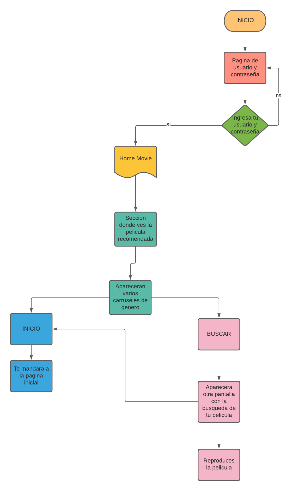
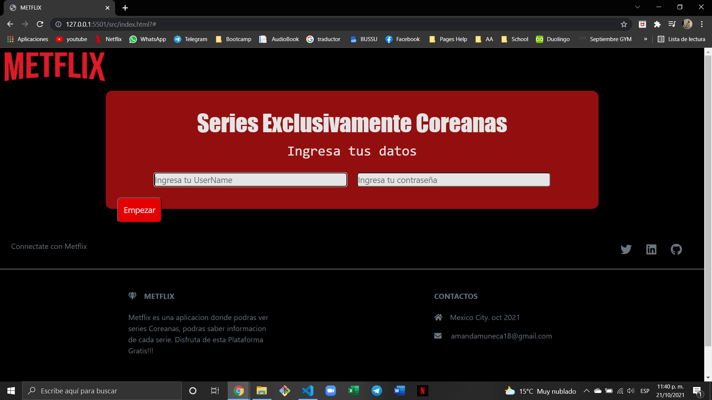
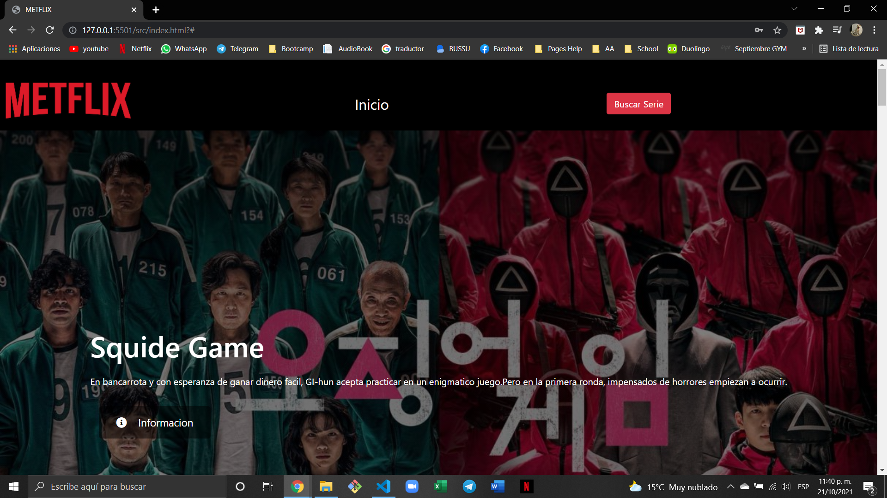
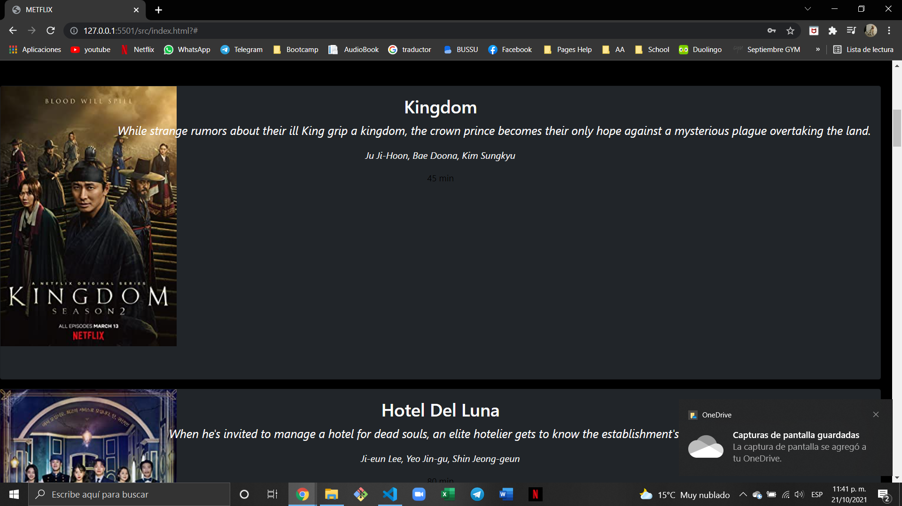
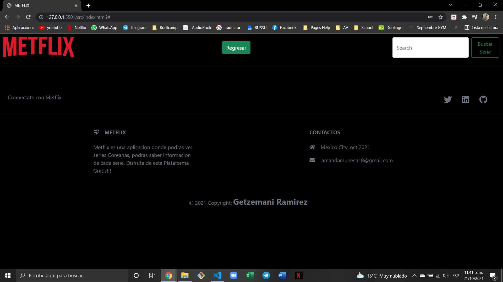

# METFLIX


---

Índice

    1. Description
    2. User Definition & User Stories (UX)
    3. Diagrama de flujo
    4. Maquetacion de Pagina
    5. Pagina Final
    6. Lenguajes Utilizados
    7. Footer

---

## 1. Descripcion

**Metflix :** Aplicacion de series donde solo veras Series Coreanas, de todo tipo de genero.

---

### Catalogo


## 2. Definicion de Usuario

El usuario podra observar un catalogo de series coreanas, podra elegir la serie que desea ver, ademas podra obtener informacion de la pelicula.

---

## 3. Diagrama de Flujo



---

## 4. Maquetacion de Pagina

[Maquetacion](https://marvelapp.com/prototype/5f7a8fe/screen/82657125)

---

## 5. Pagina Final






---

## 6. Pseudocodigo

### Funcion utilizada para la API

#### JavaScript

```JS
export let obtenerserie = (searchSerie) => { //Definimos la funcion con una documentacion "searchserie"
    fetch( "Key" + `${searchSerie}` + "Key")
    .then((response) => {
        console.log(response)
    response.json()
    .then ((data) => renderSeries(data))
    .catch((error) => console.log(error))
    }

    })
    .finally(() => console.log("Promesa Resuelta"))
```

---

## 7. Lenguajes Utilizados

- HTML5
- CSS3
- JavaScript

## 8. Footer

© Copyright 2021-Proyecto#4-Metflix Getzemani Ramirez

## 8. User and Password

- User: MetName
- Password: kdramaticas
